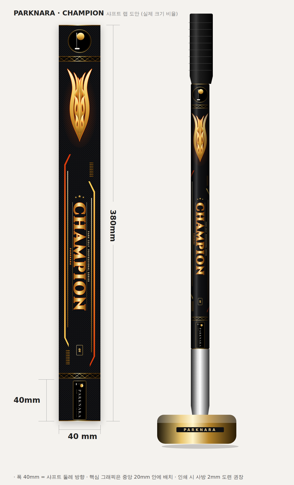
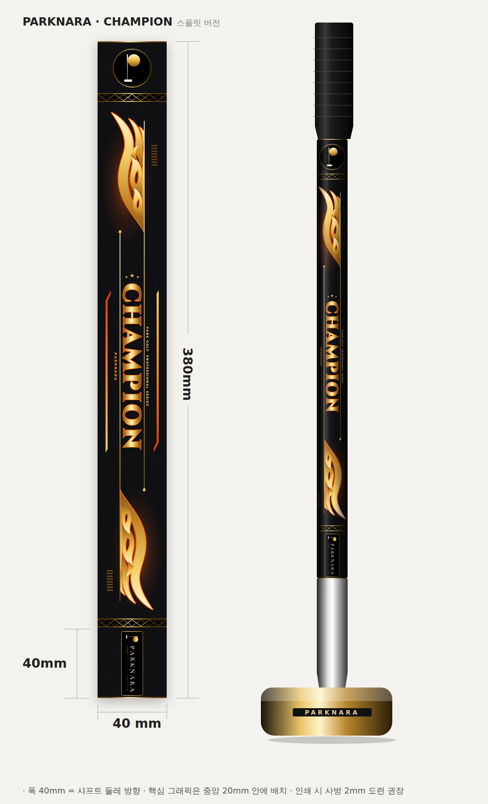
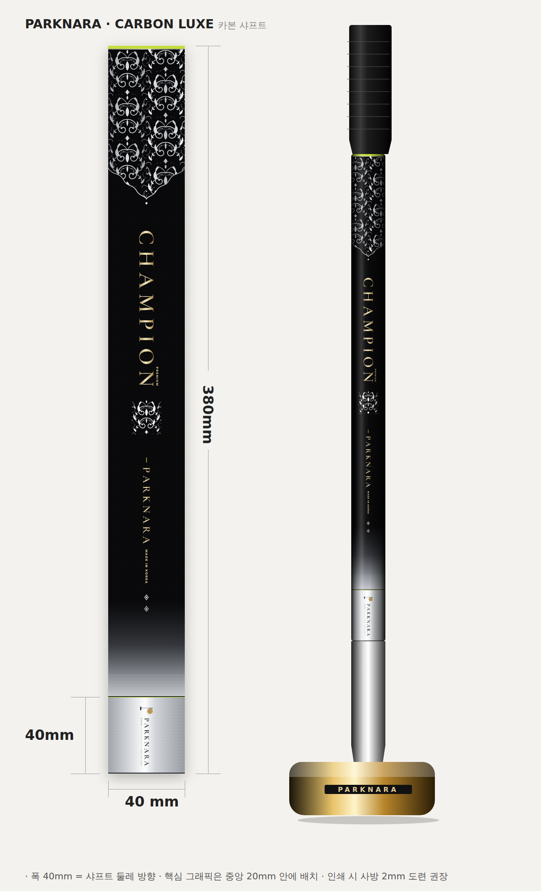

# 파크나라 CHAMPION 파크골프채 샤프트 디자인

크기: **40 × 380 mm** (하단 로고 존 40 mm). 레퍼런스 샤프트 도안의 레이아웃을 따르고, 트라이벌 문양을 벡터로 새로 그려 적용했습니다.

## 구성 (위 → 아래)
| 위치 | 내용 |
|---|---|
| 0–30 mm | 파크나라 P 모노그램 엠블럼 (골드 링) |
| 30–35 mm | 골드 트러스(지그재그) 밴드 |
| 41–111 mm | 트라이벌 플레임 (두 번째 이미지를 재해석한 벡터, 메탈 골드 + 오렌지 외곽선 + 글로우) |
| 120–330 mm | **CHAMPION** 세로 로고 (Cinzel Black, 메탈 골드), 별 3개, 오렌지 스피드 프레임, 시리즈 문구, 모델 넘버 01 |
| 334–339 mm | 골드 트러스 밴드 |
| 340–380 mm | 파크나라 정식 로고 (V2 가로형, `logo/v2` 원본 사용) |

배경은 카본 직조 텍스처입니다. 폭 40 mm가 샤프트를 감싸는 방향이므로, 핵심 그래픽은 정면에서 보이는 가운데 20 mm 안에 배치했습니다.

## 파일
| 파일 | 용도 |
|---|---|
| `parknara-champion-shaft-40x380.svg` | 원본 벡터 (mm 단위, 글자는 모두 아웃라인 처리) |
| `parknara-champion-shaft-40x380.pdf` / `.ai` | 인쇄용 실제 크기 (PDF 호환 AI, Illustrator에서 열림) |
| `parknara-champion-shaft-40x380-300dpi.png` | 300 dpi 비트맵 |
| `parknara-champion-preview.png` | 치수가 적힌 도안 + 샤프트 장착 목업 |

인쇄 참고: 색상은 RGB로 되어 있으니 발주 전에 CMYK로 바꿔 주세요. 도련은 사방 2 mm를 권장합니다(배경은 끝까지 채우기).

## 스플릿 버전 (`parknara-champion-split-*`)

트라이벌 문양을 세로 중심선에서 반으로 잘라 **왼쪽 절반은 위쪽(불꽃이 위로)**, **오른쪽 절반은 아래쪽(상하 반전, 불꽃이 헤드 쪽으로)** 에 배치했습니다.
두 조각의 잘린 면을 금선으로 길게 이어 CHAMPION 양옆 레일이 되도록 해서, 나뉜 문양이 글자를 감싸는 하나의 흐름으로 보입니다.
파일 구성은 기본 버전과 같습니다 (SVG / PDF / AI / 300dpi PNG / 프리뷰). 재생성: `build_champion_split.py`

## 카본 럭스 에디션 (`parknara-carbon-luxe-*`)

블랙 글로시 카본 바탕에 **실버 · 샴페인 골드 · 라임 포인트**만 쓴 절제된 컬러 조합입니다.
- 상단: 라임 밴드 + 실버 바로크 다마스크 레이스(20mm 칸 2개가 둘레에서 이음새 없이 맞물림), 가운데로 모이는 스캘럽 가장자리
- 메인 CHAMPION(로고와 같은 세리프) 샴페인 골드, 실버 다마스크 장식, 작은 PARKNARA 로고 글자, 보조 문구 PREMIUM · MADE IN KOREA, 실버 다이아몬드 2개
- 하단: 블랙에서 크롬 실버로 페이드, 하단 40mm는 브러시드 실버 위 파크나라 로고(밝은 배경용)
- **골드 에디션** (`parknara-carbon-luxe-gold-*`): CHAMPION · PARKNARA · 보조 문구까지 모든 글자를 선명한 비비드 골드(`#FFD54A`~`#E3A81E`, 보조 `#F7C948`)로, 큰 글자에는 얇은 어두운 테두리. 레이아웃 사양: `parknara-carbon-luxe-gold-layout.png`
- 재생성: `build_carbon_luxe.py` (문양: `damask.py`) – 기본/골드 에디션을 함께 생성

## 재생성
`FONT_DIR=<fontsource 폴더> python3 shaft-design/build_champion.py` (`pip install fonttools`, `@fontsource/cinzel`, `@fontsource/montserrat`)
